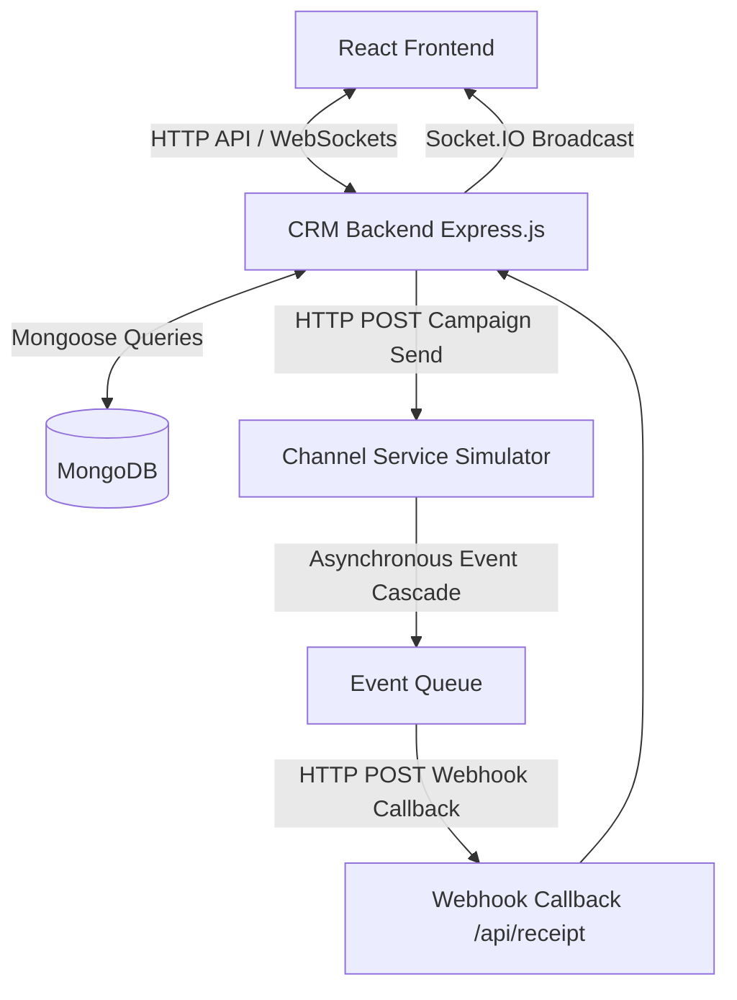
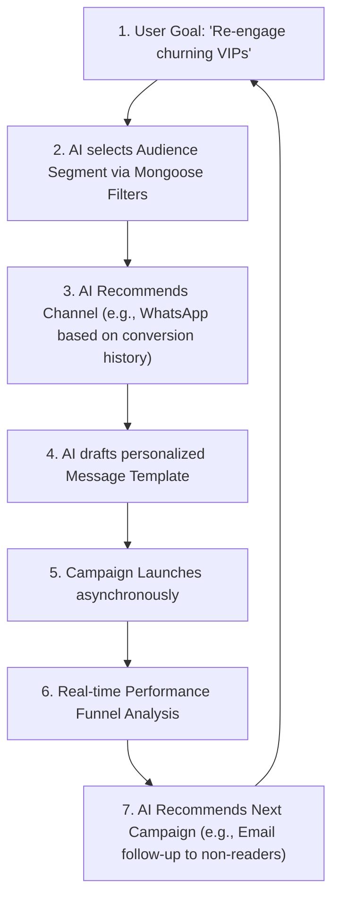

# Brew Flux — AI-Native Marketing CRM Monorepo

Brew Flux is a next-generation **AI-Native Marketing CRM** designed for consumer brands (such as **BrewLux**, our fictional premium coffee chain) to target and message shoppers across WhatsApp, SMS, Email, and RCS.

This monorepo scaffolds the entire mini CRM system:
1. **Frontend**: React + Vite + Tailwind CSS + Recharts (Dashboard, Customer Explorer, AI Assistant chat, and Campaign Funnel analytics).
2. **CRM Backend**: Express.js with Mongoose models, Mongoose schemas with proper indexing, and insights aggregation endpoints.
3. **Channel Service**: A separate Node.js Express stub service to simulate asynchronous messaging cascades (Queued → Sent → Delivered → Read → Clicked → Converted).
4. **AI Assistant**: Conversational Claude/Gemini agent framework with tool-calling capabilities.

---

## 📌 Table of Contents
* [1. Executive Summary](#1-executive-summary)
* [2. Key Features](#2-key-features)
* [3. System Architecture](#3-system-architecture)
* [4. Communication Lifecycle](#4-communication-lifecycle)
* [5. Engineering Decisions & Tradeoffs](#5-engineering-decisions--tradeoffs)
* [6. Scalability Discussion](#6-scalability-discussion)
* [7. AI-Native Workflow](#7-ai-native-workflow)
* [8. Technical Decisions & Tradeoffs](#8-technical-decisions--tradeoffs-interview-discussion-points)
* [9. Screenshots](#9-screenshots)
* [10. Architecture Diagram](#10-architecture-diagram)
* [11. Directory Tree & Project Structure](#-directory-tree--project-structure)
* [12. Running Locally](#-running-locally)
* [13. Running via Docker Compose](#-running-via-docker-compose)

---

## 1. Executive Summary

### What BrewFlux CRM is
**BrewFlux CRM** (scaffolded in this monorepo as XenoCRM) is an advanced, AI-native Customer Relationship Management platform custom-tailored for premium consumer brands like **BrewLux** (our fictional high-end coffee chain). It unifies customer telemetry, order histories, dynamic audience segments, and multi-channel campaign execution (WhatsApp, SMS, Email, RCS) into a single, cohesive marketing workspace.

### Business Problem Solved
Traditional marketing CRMs operate in silos: customer data lies in one database, audience segmentation requires writing complex SQL queries, copywriting happens in separate AI chat tabs, and execution is handed off to third-party delivery tools. This creates high operational friction, out-of-date segment lists, disjointed messaging, and slow feedback loops. 

BrewFlux CRM solves this by:
* Providing a **unified data model** linking customers, order aggregates, and real-time communication logs.
* Automating audience building and copywriting through **native AI agents** with direct system tools.
* Unifying execution and analytics, providing **instant, close-looped feedback** via webhooks and live dashboards.

### Why it is AI-Native
Unlike legacy platforms that add AI as an afterthought (e.g., a simple textbox for copy generation), BrewFlux CRM is **AI-native**. It embeds the AI assistant (**Aria**) directly into the operational loop. Using advanced **Tool Calling (Function Calling)**:
1. The AI understands natural language goals (e.g., *"Find VIP customers who haven't ordered recently and send them a discount"*).
2. It dynamically queries the database, creates target segments, and defines Mongoose aggregation filters.
3. It drafts personalized copy adjusted to the character limits and rich-media features of each communication channel.
4. It launches the campaign and tracks the delivery funnel automatically, offering recommendations for the next action based on real-time performance.

---

## 2. Key Features

* **AI Audience Builder**: Translates natural language requests into complex Mongoose query selectors. Marketers describe their target group, and the system translates it into actionable database rules.
* **AI Campaign Strategist**: Evaluates segment demographics, purchase patterns, and conversion histories to recommend the optimal communication channel and cadence.
* **AI Message Generation**: Dynamically writes tailored marketing copies, automatically adjusting tone and structure for WhatsApp templates, rich RCS cards, SMS text, or HTML emails.
* **Customer Segmentation**: Supports robust rule-based logic to filter customer cohorts dynamically based on order frequency, lifetime spend, last activity, and geographical location.
* **Campaign Launch Engine**: Manages campaign lifecycles, compiling the target audience, initializing delivery records, and streaming dispatches to execution servers.
* **Real-Time Analytics**: Visualizes aggregate sales volume, average order values, campaign conversion funnels, and customer retention metrics via an interactive Recharts dashboard.
* **AI Campaign Insights**: Maya analyzes live analytics data and provides immediate, context-aware advice on campaign optimization.
* **Separate Channel Service**: A fully decoupled Express/TypeScript service that runs independently to simulate real-world mobile networks and messaging APIs.
* **Webhook Callback Architecture**: A highly resilient webhook pipeline that feeds delivery, read, click, and conversion events back to the CRM backend to update records in real-time.

---

## 3. System Architecture

BrewFlux CRM's architecture consists of a decoupled frontend, a core CRM engine, a document database, and an independent messaging simulator connected via an event-driven webhook pipeline:



### Explanation of Components:
* **Frontend (React)**: An interactive single-page application built with React + Vite + Tailwind CSS. It hosts the dashboard charts, the customer query workspace, and the AI agent chat terminal, subscribing to live updates via WebSockets.
* **CRM Backend**: A Node.js and Express server that contains the primary business logic, database controllers, AI agent routing, Socket.IO server, and the webhook ingestion endpoint.
* **MongoDB**: A document database storing collection records for Customers, Orders, Segments, Campaigns, and Communications. Leverages indexes for fast filtering and statistics aggregation.
* **Channel Service**: A separate Node.js Express service acting as a mock telecom aggregator. It handles campaign dispatches and simulates real carrier network behaviors.
* **Webhook Callback**: The receipt endpoint (`/api/receipt`) that accepts asynchronous lifecycle events from the Channel Service, updates the database, and triggers orders.
* **Analytics Engine**: The aggregation framework inside the backend that processes raw communication logs, calculates conversion funnels, and updates dashboard metrics.

---

## 4. Communication Lifecycle

Every message sent through the campaign engine undergoes a structured, multi-state delivery lifecycle:

```
Queued ──> Sent ──> Delivered ──> Read (WhatsApp/RCS) ──> Opened ──> Clicked ──> Converted
  │         │          │
  └─────────┴──────────┴──> Failed (If bounce/error occurs)
```

### Simulation & Webhook Flow:
1. **Asynchronous Hand-off**: When a campaign launches, the CRM Backend posts target customer data to the Channel Service and returns a fast response to the client. The Channel Service uses `setImmediate()` to run the simulation in the background without blocking HTTP threads.
2. **Probabilistic Cascade**: The simulator moves the message through the lifecycle using configurable rate coefficients (`DELIVERY_RATE`, `OPEN_RATE`, `CLICK_RATE`, `CONVERT_RATE`) and random wait delays (`sleep()`) to replicate realistic human reactions:
   * **Queued** (100 - 500ms)
   * **Sent** (1000 - 3000ms after Queued)
   * **Delivered** (3000 - 8000ms after Sent, with a 90% default success rate; failures transition to `failed` and terminate).
   * **Read** (WhatsApp/RCS only, 5000 - 15000ms after Delivered, 70% probability).
   * **Opened** (10000 - 30000ms after Read or Delivered, 60% probability).
   * **Clicked** (15000 - 45000ms after Opened, 40% probability).
   * **Converted** (30000 - 120000ms after Clicked, 20% probability).
3. **Webhook Callback Dispatch**: For each state change, the Channel Service posts the event payload (`campaignId`, `customerId`, `status`, `timestamp`) back to `/api/receipt`.
4. **Idempotency & Sequence Control**: The CRM Backend webhook receiver verifies the status order sequence. If the webhook payload is a duplicate or an out-of-order update (e.g. `sent` arriving after `delivered`), it is ignored.
5. **Real-time Mutation & Broadcast**: Upon receiving a valid status:
   * The communication document is updated.
   * If the status is `converted`, the backend simulates a purchase by creating an `Order` using premium coffee menu items and increments the customer's `totalSpend` and `totalOrders`.
   * Campaign statistics are atomically incremented via MongoDB `$inc`.
   * Live statistics are broadcasted to the frontend via Socket.IO room subscriptions.

---

## 5. Engineering Decisions & Tradeoffs

To design a production-grade architecture, several technology selections were evaluated:

### Why React?
* **Decision**: React is utilized on the frontend alongside Vite and Tailwind CSS.
* **Rationale**: React’s component model is perfect for complex dashboards, interactive customer segments, and live SSE chat interfaces. Vite ensures sub-second development hot-reloading.
* **Tradeoff**: Increases JavaScript bundle size and shifts rendering overhead to the client.
* **Alternative**: *Next.js (Server Components)* or *HTMX*. HTMX would reduce client JS code, but it lacks the rich charting (Recharts) and dynamic chat component streaming flexibility offered by React.

### Why MongoDB?
* **Decision**: MongoDB (via Mongoose schemas) is used for persistence.
* **Rationale**: Customer profiles in CRMs are highly semi-structured (diverse custom attributes, preferences, metadata). A document database allows dynamic schemas without heavy migrations. Supports atomic operations like `$inc` for analytics updates.
* **Tradeoff**: Lacks strict relational constraints and multi-document ACID transactions out of the box, requiring application-level integrity checks.
* **Alternative**: *PostgreSQL*. Offers robust relational integrity and strong ACID guarantees, but requires structured tables and complex JSONB queries for dynamic customer attributes.

### Why Express?
* **Decision**: Node.js with Express.js powers both the backend and channel service.
* **Rationale**: Large ecosystem, excellent async performance, and first-class Socket.IO support make Express ideal for real-time webapps.
* **Tradeoff**: Unopinionated, requiring careful manual structure of routes, middleware, and services to prevent code sprawl.
* **Alternative**: *NestJS* or *Fastify*. NestJS provides clear structure but adds boilerplate; Fastify offers better raw speed but has a smaller middleware community.

### Why a Separate Channel Service?
* **Decision**: Decoupled messaging simulation service running on a separate port.
* **Rationale**: Prevents simulation code (timers, loops, and retry queues) from consuming backend resources. Isolates network failure domains and accurately mirrors third-party messaging aggregators (e.g., Twilio, SendGrid).
* **Tradeoff**: Introduces inter-service network overhead and requires separate orchestration profiles.
* **Alternative**: *In-App Worker (BullMQ/Redis)*. Easier to manage in a single repository, but risks resource contention on the primary backend under high load.

### Why Webhooks?
* **Decision**: Event-driven HTTP POST callback architecture.
* **Rationale**: Asynchronous delivery callbacks are the industry standard for messaging providers. They decouple execution from status tracking and prevent inefficient backend polling.
* **Tradeoff**: Requires handling out-of-order deliveries, network retries, and duplicate requests.
* **Alternative**: *Persistent WebSockets / gRPC*. While keeping a socket open guarantees speed, it is resource-intensive at scale and fails when client connections drop.

---

## 6. Scalability Discussion

Scaling the BrewFlux CRM architecture from a small test environment to enterprise-scale requires deliberate modifications to handle volume spikes:

### Scaling to 100,000 Customers
At this scale, the current architecture holds up well with minor configurations:
* **Database**: Implement basic indexes on `Communication` (`campaignId`, `customerId`, `status`) and `Order` (`customerId`). Read replicas are not yet necessary.
* **Execution**: Single server instances for backend and channel service can comfortably handle dispatches using Node's standard asynchronous loops.

### Scaling to 1,000,000 Customers
At one million customers, file descriptors and in-memory variables become bottlenecks:
* **Caching with Redis**: Use Redis to store active campaigns, live stats, and session states. Utilize Redis for idempotency locks to drop duplicate webhooks instantly.
* **Message Queues (BullMQ)**: Replace the backend’s `setImmediate` and the channel service's in-memory timers with a reliable Redis-backed queue like **BullMQ**. This ensures tasks are persisted and retried if a server crashes.
* **Horizontal Scaling**: Run multiple instances of the backend and channel service behind an ALB (Application Load Balancer), using sticky sessions for WebSockets.

### Scaling to 10,000,000 Customers
To handle ten million customers and hundreds of millions of events:
* **Event Streaming with Apache Kafka**: Introduce Apache Kafka as the central event bus. The channel service publishes events directly to Kafka topics, and consumer groups on the backend ingest them sequentially, preventing database write exhaustion.
* **Database Sharding & Time-Series DB**: Shard the MongoDB cluster by `customerId`. Move high-volume communication lifecycle logs to a specialized time-series database like **ClickHouse** or **TimescaleDB** to keep analytical queries fast.
* **Autoscaling Kubernetes Pods**: Deploy services in Kubernetes, setting autoscalers to scale worker nodes up during active campaign launches and down during quiet hours.

---

## 7. AI-Native Workflow

The end-to-end campaign workflow is designed around close-loop agentic feedback, where the AI guides the marketer from goals to insights:



---

## 8. Technical Decisions & Tradeoffs (Interview Discussion Points)

This section documents critical implementation decisions made during the design of XenoCRM, highlighting tradeoffs and technical resolutions:

### 1. Database Design & Indexing
To ensure high-performance analytics, our Mongoose models enforce specific compound indexes. For instance, the `Communication` collection indexes `[campaignId, status]` to quickly compute real-time funnel stages, and `[customerId, status]` to resolve customer history.
* *Tradeoff*: Indexing increases write latency and memory usage in MongoDB, but is essential to maintain sub-second queries as datasets grow.

### 2. Webhook Ingestion Pipeline
The `/api/receipt` endpoint uses an asynchronous ingestion pattern:
1. Validates the request body.
2. Checks status transitions against the sequence array.
3. Responds with HTTP `200 OK` to release the simulator client.
4. Executes the database writes, order creation, and Socket.IO broadcasts in the background using `setImmediate()`.
* *Tradeoff*: Returns success to client before the database write is finalized. If the database crashes mid-write, the message is lost unless the sender implements retry limits.

### 3. Channel Simulation Engine
The simulator models carrier behaviors asynchronously. By using environment configurations like `DELIVERY_RATE`, it simulates bounce rates, network dropouts, and timing delays (using randomized ranges of `setTimeout`).
* *Tradeoff*: Standard `setTimeout` in Node.js is not highly precise for millions of concurrent tasks, but is perfect for development simulation without heavy overhead.

### 4. Resilient Webhook Retry Logic
The Channel Service's webhook client has built-in retry handling. If the CRM backend fails or times out, the client retries the callback up to 3 times, waiting `2s`, `4s`, and then `8s` (exponential backoff).
* *Tradeoff*: Retries can create duplicate delivery requests if the backend processed the write but failed to return a timely HTTP response. This is handled by backend idempotency.

### 5. Out-of-Order Event Processing
Webhooks can arrive out of sequence due to network routing. The backend enforces order sequence using a status array index. If a status change request comes in for a status that is chronologically prior to the current state (e.g. receiving `sent` when the record is already `delivered`), the update is discarded silently.
* *Tradeoff*: Simplifies state management, but requires the client to send accurate event timestamps if exact audit logs are needed.

### 6. Tool-Calling AI Integration
The AI agent (**Maya**) utilizes tool-calling instead of raw text completions. The system exposes structured JavaScript tools (e.g. `queryCustomers`, `launchCampaign`). The agent decides which tools to call based on the user's prompt, executing them directly in the backend and rendering the results inside rich React components.
* *Tradeoff*: Limits the agent's creativity, but ensures safety, structure, and direct utility within the CRM platform.

---

## 9. Screenshots

* **Dashboard**:  
  
* **Customer Explorer**:  
  
* **AI Assistant**:  
  
* **Campaign Analytics**:  
  

---

## 10. Architecture Diagram

Detailed system interaction layout:  


---

## 🛠️ Tech Stack & Dependencies
- **Frontend**: React (Vite) + Tailwind CSS (v4) + Lucide Icons + Recharts
- **Backend**: Node.js + Express.js + Mongoose + MongoDB + Socket.IO
- **Simulated messaging channel**: Node.js + Express.js stub simulating delays and delivery statuses
- **Containerization**: Docker & Docker Compose

---

## 📦 Directory Tree & Project Structure
```text
/xenocrm
├── frontend/
│   ├── src/
│   │   ├── pages/
│   │   │   ├── Assistant.jsx      ← AI chat workspace
│   │   │   ├── Dashboard.jsx      ← Analytics insights
│   │   │   ├── Customers.jsx      ← Customer profile explorer
│   │   │   └── CampaignDetail.jsx ← Live funnel tracking
│   │   ├── components/
│   │   │   ├── Sidebar.jsx
│   │   │   ├── Chat/
│   │   │   │   ├── MessageList.jsx
│   │   │   │   ├── ToolCard.jsx
│   │   │   │   └── InputBar.jsx
│   │   │   └── Campaign/
│   │   │       ├── Funnel.jsx
│   │   │       └── Timeline.jsx
│   │   └── App.jsx
│   ├── .env.example
│   └── Dockerfile
├── backend/
│   ├── models/
│   │   ├── Customer.js            ← Customer schema + indexes
│   │   ├── Order.js               ← Orders details + indexes
│   │   ├── Segment.js             ← Customer segments + rules
│   │   ├── Campaign.js            ← Campaigns + stats
│   │   └── Communication.js       ← Dispatch delivery logs + indexes
│   ├── routes/
│   │   ├── agent.js               ← AI assistant chat + SSE
│   │   ├── campaigns.js           ← Campaign launch engine
│   │   ├── receipt.js             ← Delivery callback webhook receiver
│   │   ├── customers.js           ← Customers query/filters
│   │   └── insights.js            ← Dashboard analytics aggregation
│   ├── tools/                     ← Claude tool handlers
│   │   ├── queryCustomers.js
│   │   ├── createSegment.js
│   │   ├── draftMessage.js
│   │   ├── launchCampaign.js
│   │   └── getCampaignStats.js
│   ├── seed.js                    ← Seeding engine (500 customers, 2000 orders)
│   ├── index.js                   ← Express entrypoint & Socket.IO
│   ├── .env.example
│   └── Dockerfile
├── channel-service/
│   ├── index.js                   ← Webhook simulation
│   ├── .env.example
│   └── Dockerfile
├── docker-compose.yml             ← Orchestration profile
└── README.md
```

---

## 🚀 Running Locally

### Prerequisites
- Node.js (v18+)
- MongoDB running locally (or in Docker)

### 1. Backend Seeding and Startup
First, set up your backend configurations:
```bash
cd backend
cp .env.example .env
npm install
```

Make sure MongoDB is running on `mongodb://localhost:27017/xenocrm`.
Run the faker-driven seed script to populate **500 customers**, **2000 orders**, and initial segments:
```bash
npm run seed
```
Start the CRM backend API:
```bash
npm run dev
```

### 2. Channel Service Startup
Open another terminal:
```bash
cd channel-service
cp .env.example .env
npm install
npm run dev
```

### 3. Frontend Startup
Open another terminal:
```bash
cd frontend
cp .env.example .env
npm install
npm run dev
```
Open your browser at `http://localhost:3000`.

---

## 🐋 Running via Docker Compose
To boot up the entire stack (MongoDB, Backend, Channel Service, Frontend) together:
1. Make sure you set your Anthropic API Key in the environment or in the docker-compose.yml file.
2. Run:
```bash
docker-compose up --build
```
3. To seed database inside the container:
```bash
docker-compose exec backend npm run seed
```
